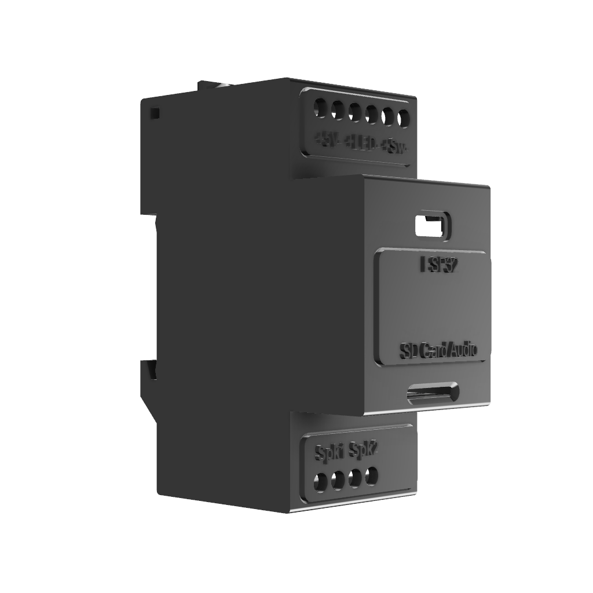
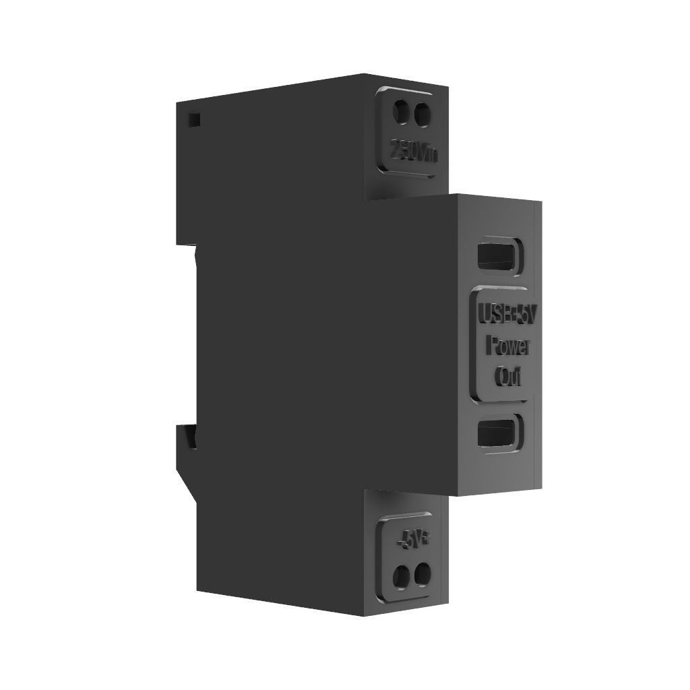
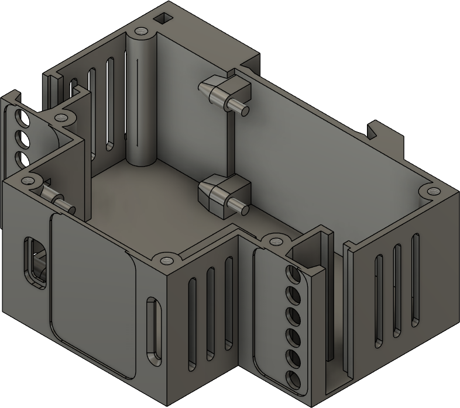
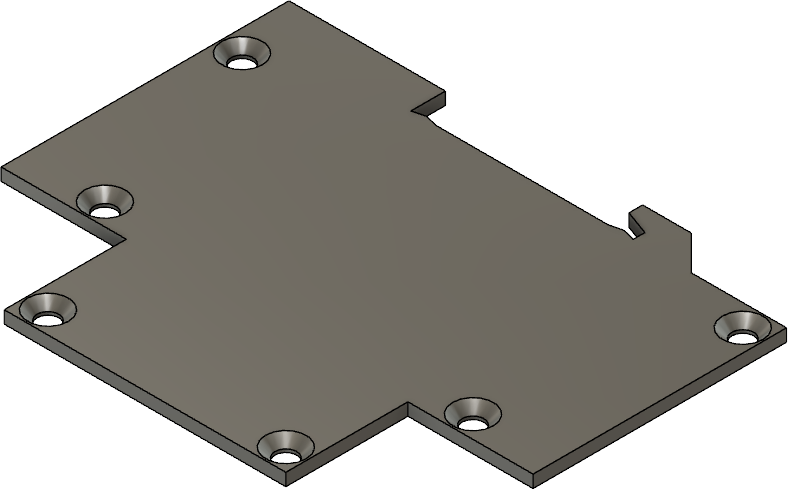
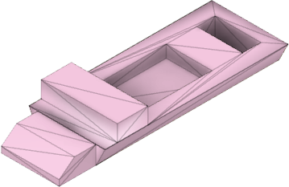
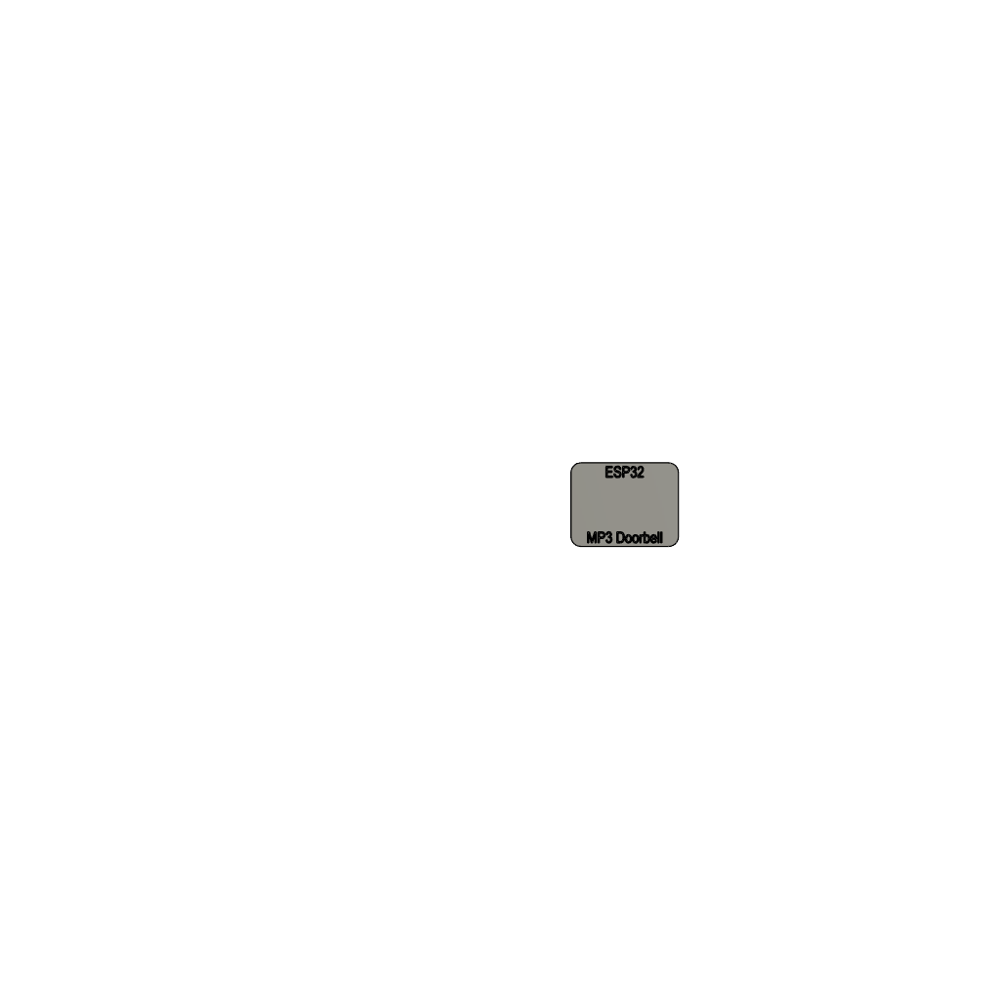
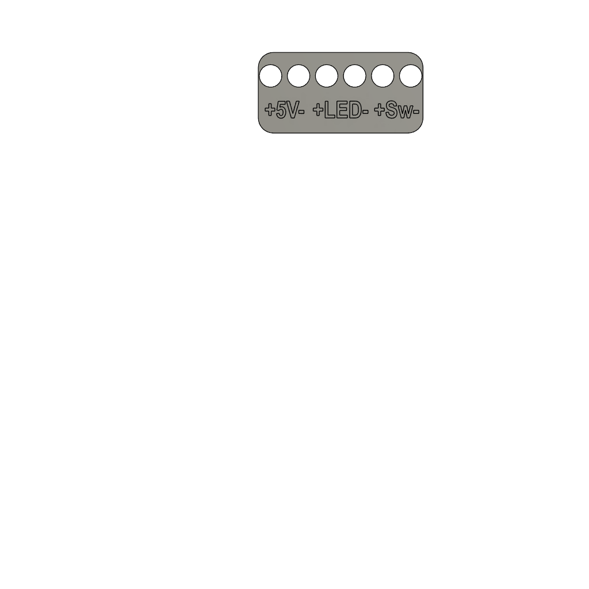
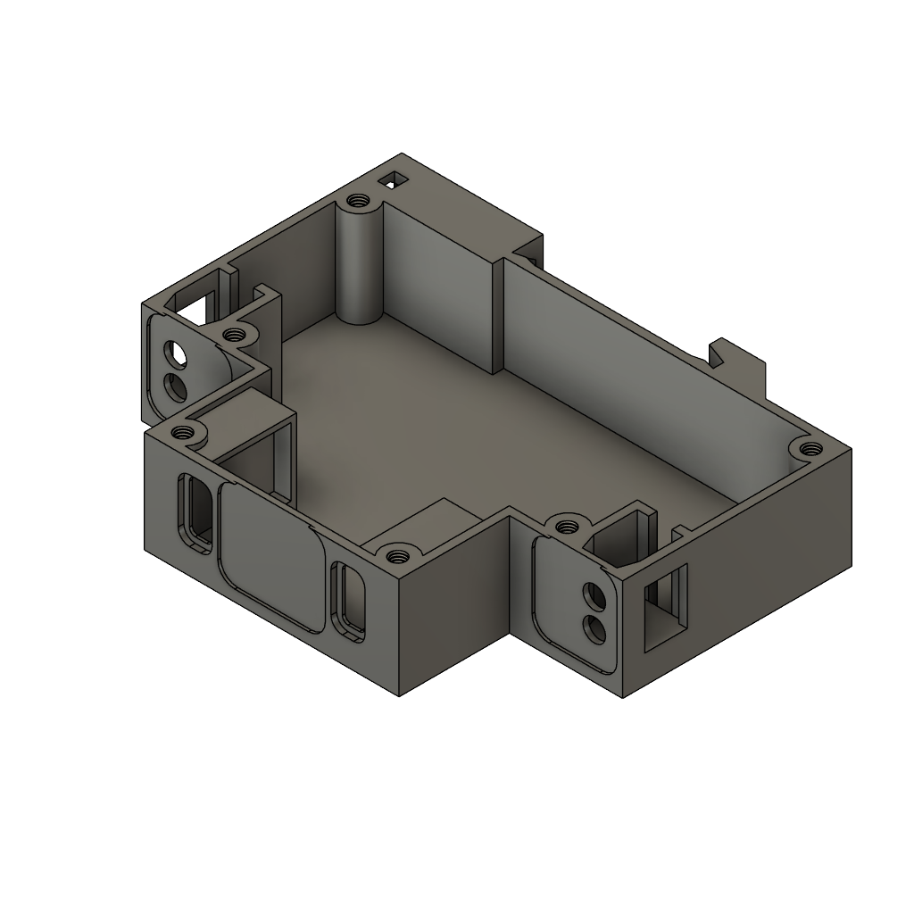
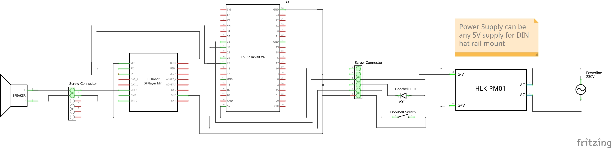

# Multi-purpose MP3 doorbell for home assistant

An ESP32 based doorbell for use with home assistant with the doorbell sound of your choice via SD card.

- A robust 3D printed structure for mounting on a DIN rail
- fully functional doorbell running independent from home assistant
- can be used as audio output device for any automation in home assistant - not limited to doorbell usecase
- provide your own sounds via MP3 SD card
- support for doorbell light including light effects when ringing  
- State and events exposed in home assistant via ESP home so that you can use the doorbell to trigger subsequent actions and automations 
- low cost hardware of about 10 USD
- optional 5V power supply including double USB C port
- Example code provided (e.g. trigger camera snapshot)


| Doorbell DIN rail case | Optional 5V power supply including double USB power out |
| ---------------------------- | --------------------------------------------------------------------|
|   |  |


## Mechanics

The only mechanical part required is the housing for the electronics. 
The case consist of a base and a side wall connected via screws. 
It can fit on a DIN rail and is tightened via a hook. 

If you want to build the 5V power supply as well, you can use the same side wall as for the doorbell case.

If you have two color print capability, you can optionally print labels for the screw connectors and the top of the case.


### 3D-Printed Parts

ESP doorbell:
| Filename                     | Thumbnail                                                           | Required |
| ---------------------------- | --------------------------------------------------------------------| -------- |
| `./print/case.stl`           |      | 1        |
| `./print/sidewall.stl`       |          | 1        |
| `./print/hook.stl`           |                   | 1        |
| `./print/label.stl`          |                 | optional |
| `./print/label_top.stl`      |         | optional |
| `./print/label_bottom.stl`   |   | optional |


Optional: separate 5V power supply:
| Filename                     | Thumbnail                                                           | Required |
| ---------------------------- | --------------------------------------------------------------------| -------- |
| `./print/sidewall.stl`       |          | 1        |
| `./print/power_supply.stl`   |   | 1        |


Printer settings:
- All printed parts designed for PETG. 
- Best experience on my printer was to print the case using tree style support. 
- No rafts/brim etc. reguired for any model.

### Required screws


ESP doorbell:
| Name              | Spec    | Required |
| ----------------- | ------- | -------- |
| Countersunk screw | M4 6mm  | 6        |


Optional: separate 5V power supply:
| Name              | Spec    | Required |
| ----------------- | ------- | -------- |
| Countersunk screw | M4 6mm  | 6        |


## Assembly

Use hotglue to hold all electronic components in place within the housing (screw terminals, ESP32 and RF player).

Screw the side wall to the base of the case via the M4 screws.

Fit the cases to the DIN rail and fix them inserting the hook.


## Electronics

### Part list

ESP doorbell:
| Name                         | Required             | Note      |
| ---------------------------- | -------------------- | --------- |
| ESP32 Dev Module             | 1                    | Case designed for WROOM USB-C type |
| DF Player mini               | 1                    |           |
| Screw Terminals              | 2 x 6 terminals each | 5mm pitch |
| micro SD card                | 1                    | to Hold MP3 files. Check DF player specs to pick the right card, e.g. max capacity |
| 8 Ohm Speaker                | 1                    |           |
| Doorbell button              | 1                    | consider using button including 5V LED lighting |


5V power supply:
| Name                         | Required             | Note      |
| ---------------------------- | -------------------- | --------- |
| Screw Terminals              | 2 x 2 terminals each | 5mm pitch |
| 5V power supply              | 1                    |           |
| USB connector                | 2                    |           |


### Schematics

The wiring in the case is pretty much self explanatory and you can use the screw terminals according to your needs.




If you want to use the same screw terminal connections I used, then please take a look at the labeling models and what they tell which screw terminal is used for which purpose. 


Make sure to establish the following connections within the housing between ESP, DF Player and terminals:
- ESP GPIO26 TX (Pin 15) --> DF Player RX (Pin 2)
- ESP GPIO27 RX (Pin 16) --> DF Player TX (Pin 3)
- DF Player Spk1+Spk2 --> Speaker 8 Ohm
- ESP GPIO33 (internal pullup) --> Doorbell button
- ESP GPIO32 --> Doorbell LED
- 5V and GND from screw terminal to DF player and ESP
- Consider connecting ground to two more screw terminals to be used for the LED and the button


All external connection are done via the screw connectors:
- Power supply is 5V DC and can be optionally build using the parts described herein (Warning, this is dangerous voltage level!). If you want to be on the safe side, buy a suitable standard DIN rail power supply from the shelf. Do not use your old fashioned bell transformer as this is AC!
- Can be connected directly to a single 8 Ohm speaker for output. No further amp required, also no resistors for volume regulation as output volume is controlled via SW.
- The bell button is a simple closing contact to ground with internal pullup.
- Optionally, an LED can be attached via GPIO output connected to ground, e.g. to light up the bell button at night. Please note that this is directly connected to GPIO of the ESP, so don't draw too much current (should be sufficient for up to 4 standard LEDs though)!


# Example usages 

Adopting the ESP as device to home assistant via ESP home allows for flexible usage for different scenarios for which the following chapter illustrates some examples.


## MP3 doorbell

The YAML provided as ESP home integration already includes this doorbell usecase "hardcoded" for robustnes reasons as it does not require an automation in HA and no signals need to be send to home assistant back and forth
If you don't need this, just strip down the code to make it become a generic device to play MP3 files triggered by home assistant. 

Features
- Fully functional doorbell not requiring any interaction with home assistant (robustnes, latency)
- Exposes doorbell to home assistant so you can use it to trigger automations 
- Configurable volume and doorbell sound via HA GUI
- Test buttons and diagnosis signals provided to HA GUI
- DF player API provided to HA for even more flexible use in automations
- As my DF player sometimes "hangs" and playback is never ended automatically blocking further calls, a watchdog is used which resets DF player 2min after the doorbell was triggered if it is still playing 
- Although the original DF player supports sleep mode and it could be used to save power in the doorbell usecase, I disabled this feature in code as I found waking up from sleep doesn't work reliably for most DF players sold these days. You can uncomment the corresponding lines in code if you want to try this out for your player

You can find the YAML source code for home assistant in `./esphome_src/`
- `./esphome_src/doorbell-sound.yaml` main file for ESP home configuration, contains the relevant source code, imports all following packages
- `./esphome_src/shared_packages/debug_basics.yaml` Adds debug releated entities (optional), generic - not limited to use in this project


Note: DF player only supports certain SD cards and requires it to be formated in the right file system. See DF player documentation for details. 
It is also noteworthy that DF player plays the MP3 files on the SD card by the order of the FAT entry. Advising the player to play file #3 plays the third file that was written to the sd card - no matter of its filename or folder location.


Tip: Consider seasonal modes such as special Halloween sounds for your doorbell

## Camera snapshot

As the doorbell exposes the doorbell button as entity in HA, you can use a change to this entity state to trigger automations.
This can be anything, e.g. switching the light on at the door when its dark.


A more advanced usecase would be to take a snapshot of the visitor and interpret it via Gemini integration in order to send you a push notification including information about who rang the bell.


This can be achieved by adding the Gemini generative AI integration to your HA and add some automations.

Using the following prompt you can interpret a camera image:
```
Very briefly describe what you see in the brick semi-circle area in front of my frontdoor in this image that was taken when the doorbell was rung.
Your message needs to be very short to fit in a phone notification and must not be longer than a single sentence. 
Don't describe stationary objects or buildings or vehicles in driveway. 
If you cannot identify people for sure, then tell me so. 
Otherwise tell me whether it seems to be visitors such as kids or a family or if it is a handcraftsman, a postman or a delivery man.  
Please don't describe their clothing. 
Please tell me if there is no one but there is a parcel or other item that they left at the door.
```

Example automation that uses this prompt and embedds it into a fully automated flow triggered when the doorbell is rung:
```yaml
triggers:
- trigger: state
  entity_id:
    - event.doorbell_sound_doorbell_button
  attribute: event_type
  to: button_pressed
conditions: []
actions:
- metadata: {}
  data: {}
  target:
    entity_id: camera.camera_frontdoor
  action: camera.turn_on
- data:
    filename: '{{ snapshot_create_file_path }}'
  enabled: true
  target:
    entity_id: camera.camera_frontdoor
  action: camera.snapshot
- metadata: {}
  data:
    notify_devices:
    - YOURDEVICEID
    notify_home_or_away: Both
    data_notification_icon: mdi:doorbell
    notify_title: Doorbell {{ time }}
    notify_message: Please wait for Gemini to interpret the image
    data_visibility: public
    data_ios_interruption_level: time-sensitive
    data_tag: '{{this.context.id}}'
    data_camera: '{{ snapshot_access_file_path }}'
  action: script.notify_devices
- parallel:
  - choose: []
    default:
    - entity_id: camera.camera_frontdoor
      data:
        filename: /media/frontdoor_camera/archive/motion_{{now().strftime("%Y%m%d-%H%M%S")}}.jpg
      enabled: true
      action: camera.snapshot
    - entity_id: camera.camera_frontdoor
      data:
        filename: /media/frontdoor_camera/last_motion.jpg
      action: camera.snapshot
  - choose: []
    default:
    - data:
        prompt: "YOUR PROMPT HERE"
        image_filename: '{{ snapshot_create_file_path }}'
      response_variable: generated_content
      action: google_generative_ai_conversation.generate_content
    - metadata: {}
      data:
        notify_devices:
        - YOURDEVICEID
        notify_home_or_away: Both
        data_notification_icon: mdi:doorbell
        notify_title: Doorbell {{ time }}
        notify_message: '{{ generated_content.text }}'
        data_visibility: public
        data_ios_interruption_level: time-sensitive
        notify_tts_in_car: true
        data_tag: '{{this.context.id}}'
        data_camera: '{{ snapshot_access_file_path }}'
      action: script.notify_devices
variables:
  generated_content: undefined
  camera: camera.camera_frontdoor
  camera_name: '{{ states[camera].name }}'
  time: '{{ now().strftime("%H:%M") }}'
  date: '{{ now().strftime("%Y-%m-%d") }}'
  snapshot_create_file_path: /config/www/tmp/snapshot_{{ states[camera].object_id}}.jpg
  snapshot_access_file_path: '{{ snapshot_create_file_path | replace(''/config/www'',''/local'')}}'
mode: parallel
max: 10
```
Note that his uses helper scripts not shown here to create and uptate push notification to mobile devices


## Home Reminder

As the doorbell provides an API with full control of the DF player, you can use this to play sounds on certain triggers via automations.
An example would be, to play a sound to not forget to switch off the lights when leaving home (e.g. when your front door contact is triggered).

For this, you can add to your SD card suitable sound effects or even prepare TTS output in MP3s (there are free tools on the internet to create such MP3s for predefined text input via TTS services).

```yaml
triggers:
- entity_id:
- binary_sensor.doorstate_frontdoor_contact
to: 'on'
id: start
for:
    hours: 0
    minutes: 0
    seconds: 5
from: 'off'
trigger: state
conditions: []
actions:
- action: esphome.doorbell_sound_dfplayer_play
data:
    file: 46
mode: single
```

