# Multi-purpose MP3 doorbell for home assistant

[](#)
[](#)
[](#)

This project features an ESP32-based doorbell designed for integration with Home Assistant. It allows you to play custom doorbell sounds from an SD card or stream audio, making it a versatile addition to your smart home setup.

Features
- Robust Design: A 3D-printed structure for mounting on a DIN rail.
- Standalone Functionality: Fully functional doorbell without any need to build automations in home assistant
- Versatile Audio Output: Can be used as an audio output device for any Home Assistant automation, not limited to doorbell use.
- Custom Sounds: Play your own MP3 files as ringtone
- SD card support: Optional support to provide exchangeable ringtones via SD card or use streaming audio via a network player.
- Doorbell Light Support: Includes light effects when ringing.
- Home Assistant Integration: Exposes states and events via ESPHome, enabling triggers for automations.
- Low-Cost Hardware: Build the doorbell for approximately $10.
- Optional Power Supply: Separate 5V power supply with dual USB-C ports for usage with other DIN rail parts.
- Example Automations: Includes example code for triggering actions when door in rung like camera snapshots.


| Module | Rendering |
| ---------------------------- | --------------------------------------------------------------------|
| Doorbell DIN rail case | 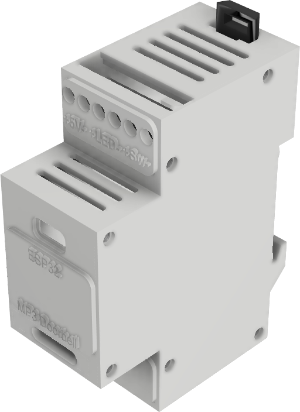 | 
| Doorbell DIN rail case (no SD card version) | 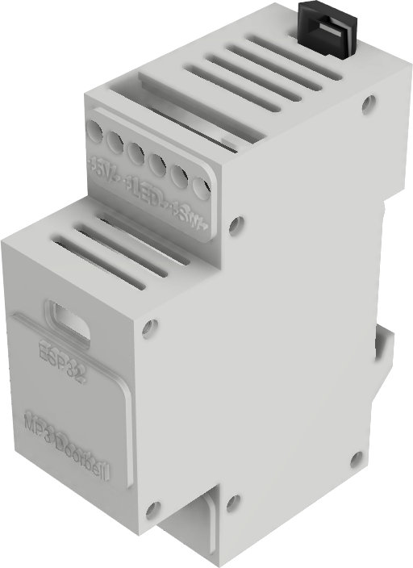 |
| Optional 5V power supply including double USB power out | 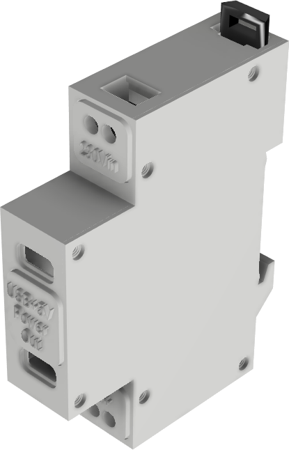 |


# Index
- [Mechanics](#Mechanics)
- [Electronics](#Electronics)
- [Usage: MP3 doorbell](#mp3-doorbell)
- [Usage: MP3 doorbell with SD card ringtones](#mp3-doorbell-with-sd-card-ringtones)
- [Usage: MP3 doorbell with streaming audio ringtones](#mp3-doorbell-with-streaming-audio-ringtones)
- [Usage: Camera snapshot](#doorbell-with-camera-snapshot-and-ai-push-notification)
- [Usage: Home Reminder](#home-reminder)
- [Acknowledgements](#Acknowledgements)


 


## Mechanics

The housing is the only mechanical part required for this project. It consists of a base and a side wall connected via screws. The case is designed to fit on a DIN rail and is secured with a hook.

There is a housing variant with SD card slot and one without which require slightly different electronics.

If you choose to build the optional 5V power supply, the same side wall and hook is used as for the doorbell case.

If you have the capabilities to print in multiple colors, you can optionally print labels for the screw connectors and the top of the case.


### 3D-Printed Parts


Shared for all modesl:
| Filename                     | Thumbnail                                    | Required |
| ---------------------------- | -------------------------------------------- | -------- |
| `./print/shared_parts/sidewall.stl`       | 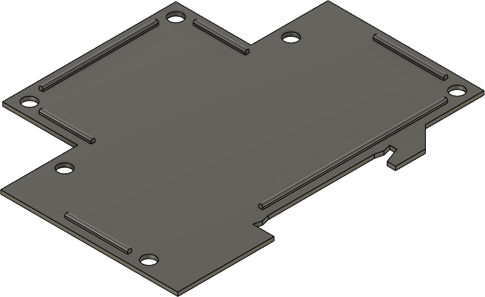 | 1        |
| `./print/shared_parts/hook.stl`           | 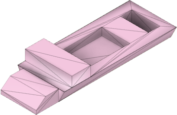     | 1        |


ESP doorbell
| Filename                     | Thumbnail                                         | Required |
| ---------------------------- | ------------------------------------------------- | -------- |
| `./print/doorbell/case.stl`           | 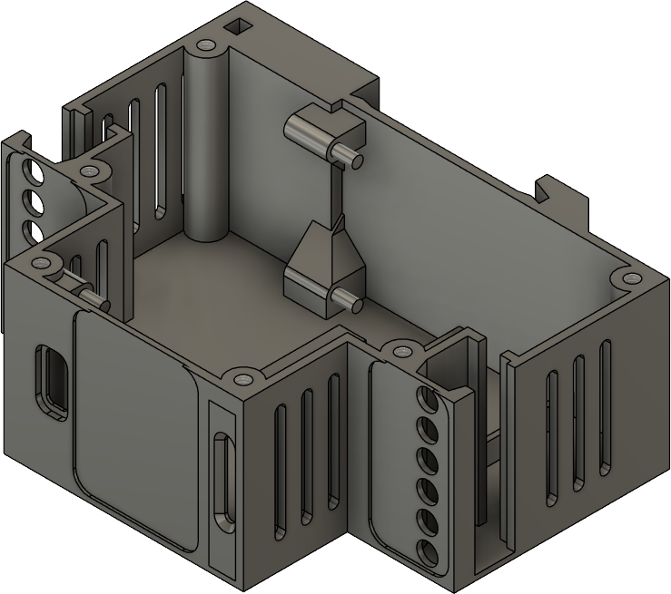          | SD card version |
| `./print/doorbell/case_no_sd.stl`     |     | No SD card version |
| `./print/doorbell/label.stl`          | 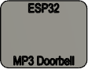         | optional |
| `./print/doorbell/label_top.stl`      | 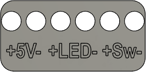     | optional |
| `./print/doorbell/label_bottom.stl`   |   | optional |


5V power supply:
| Filename                                | Thumbnail                                                      | Required |
| --------------------------------------- | -------------------------------------------------------------- | -------- |
| `./print/power_supply/power_supply.stl`              | 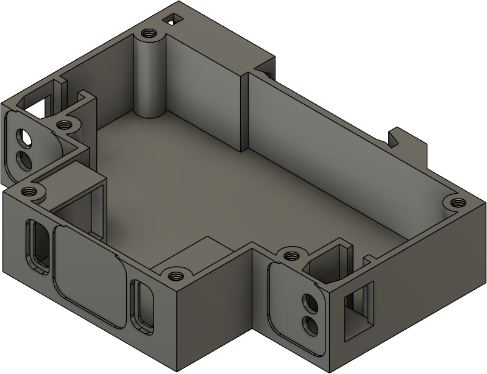               | 1        |
| `./print/power_supply/power_supply_label_main.stl`   |     | optional |
| `./print/power_supply/power_supply_label_top.stl`    | 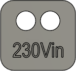     | optional |
| `./print/power_supply/power_supply_label_bottom.stl` | 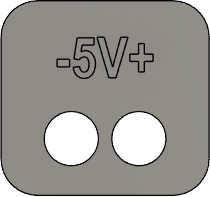  | optional |


Printer settings:
- Material: PETG or PLA.
- Orientation: Print parts as shown in the thumbnails.
- Supports: Not required unless for the ESP mounting tips (use paint-on supports in your slicer).
- Rafts/Brims: Not required.

### Assembly

- Use hot glue to secure all electronic components (e.g., screw terminals, ESP32, DF Player) inside the housing after you have done the wiring.
- Attach the side wall to the base using six M3 5mm screws.
- Mount the case on the DIN rail and secure it with the hook.


## Electronics

If you want the user to be able to change the doorbell sound at runtime without recompiling, please build the variant with SD card (ESP doorbell I), otherwise build the simpler variant (ESP doorbell II). Further below I will show how the variant without SD card can be modified to use streamed doorbell sound.

All external connection are done via the screw connectors:
- Power supply is 5V DC and can be optionally build using the parts described herein (Be cautios, this is dangerous voltage level!). If you want to be on the safe side, buy a suitable standard DIN rail power supply from the shelf. Do not use your old fashioned bell transformer as this is AC!
- Can be connected directly to a single 8 Ohm speaker for output. No further amp required, also no resistors for volume regulation as output volume is controlled via SW.
- The bell button is a simple closing contact to ground with internal pullup.
- Optionally, an LED can be attached via GPIO output connected to ground, e.g. to light up the bell button at night. Please note that this is directly connected to GPIO of the ESP, so 5V don't draw too much current (should be sufficient for up to 4 standard LEDs though)!


### ESP doorbell I (SD card support)

| Unit price | Quantity | Partname | Example | Notes |
| ---------- | -------- | -------- | ------- | ----- |
| 5 USD | 1 | ESP32 Dev Module | <a href="https://de.aliexpress.com/item/1005006336964908.html">AliExpress</a> | Case designed for WROOM USB-C type |
| 2 USD | 1 | DF Player mini | <a href="https://de.aliexpress.com/item/1005006263283726.html">AliExpress</a> |  |
| 1 USD | 2 | 6 pin screw terminal | <a href="https://de.aliexpress.com/item/1005006642865467.html">AliExpress</a> | 5mm pitch |
| 3 USD | 1 | micro SD card | | Required to provide MP3 files. Check DF player specs to pick the right card, e.g. max capacity |
| use your home installation | 1 | 8 Ohm Speaker | dismantle this one from <a href="https://de.aliexpress.com/item/33042023659.html?spm=a2g0o.order_list.order_list_main.478.499c5c5f3pOQDE&gatewayAdapt=glo2deu">AliExpress</a> |
| use your home installation | 1 | Doorbell button | <a href="https://de.aliexpress.com/item/1005004920346156.html">AliExpress</a> | consider using button including 5V LED lighting |

ESP doorbell I (SD card/DF player):
Make sure to establish the following connections within the housing between ESP, DF Player and terminals:
- ESP GPIO26 TX (Pin 15) --> DF Player RX (Pin 2)
- ESP GPIO27 RX (Pin 16) --> DF Player TX (Pin 3)
- DF Player Spk1+Spk2 --> Speaker 8 Ohm
- ESP GPIO33 (internal pullup) --> Doorbell button
- ESP GPIO32 --> Doorbell LED
- 5V and GND from screw terminal to DF player and ESP
- Consider connecting ground to two more screw terminals to be used for the LED and the button

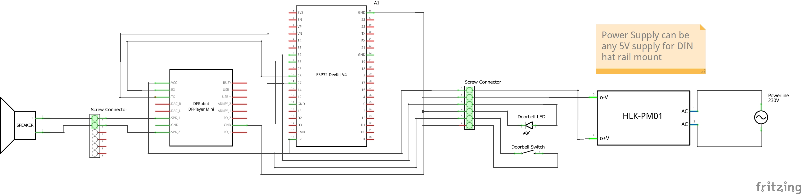


### ESP doorbell II (No SD card: build-in ringtone or streaming audio):

| Unit price | Quantity | Partname | Example | Notes |
| ---------- | -------- | -------- | ------- | ----- |
| 5 USD | 1 | ESP32 Dev Module | <a href="https://de.aliexpress.com/item/1005006336964908.html">AliExpress</a> | Case designed for WROOM USB-C type |
| 1 USD | 1 | MAX98357A I2S Amplifier | <a href="https://de.aliexpress.com/item/1005008814235354.html">AliExpress</a> | |
| 1 USD | 2 | 6 pin screw terminal | <a href="https://de.aliexpress.com/item/1005006642865467.html">AliExpress</a> | 5mm pitch |
| use your home installation | 1 | 8 Ohm Speaker | dismantle this one from <a href="https://de.aliexpress.com/item/33042023659.html?spm=a2g0o.order_list.order_list_main.478.499c5c5f3pOQDE&gatewayAdapt=glo2deu">AliExpress</a> |
| use your home installation | 1 | Doorbell button | <a href="https://de.aliexpress.com/item/1005004920346156.html">AliExpress</a> | consider using button including 5V LED lighting |

Make sure to establish the following connections within the housing between ESP, I2S amplifier and terminals:
- GPIO26 --> I2S Amp LRCLK 
- GPIO27 --> I2S Amp BCLK 
- GPIO25 --> I2S Amp DATA 
- I2S Amp Spk1+Spk2 --> Speaker 8 Ohm
- ESP GPIO33 (internal pullup) --> Doorbell button
- ESP GPIO32 --> Doorbell LED
- 5V and GND from screw terminal to I2S Amp and ESP
- Consider connecting ground to two more screw terminals to be used for the LED and the button

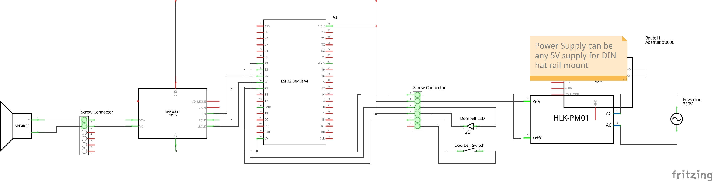


### 5V power supply:
| Unit price | Quantity | Partname | Example | Notes |
| ---------- | -------- | -------- | ------- | ----- |
| 1 USD | 2 | 2 pin screw terminal | <a href="https://de.aliexpress.com/item/1005006642865467.html">AliExpress</a> | 5mm pitch |
| 2 USD | 1 | 5V power supply | <a href="https://de.aliexpress.com/item/1005005021311232.html">AliExpress</a> |  |
| 1 USD | 2 | USB connector | <a href="https://de.aliexpress.com/item/1005005776162012.html">AliExpress</a> |  |


## Usage

- Click in to DIN rain and secure via the hook
- Once powered on, adopt the device via ESP home
- Adapt it to your usage scenarios via home assistant (see examples below)


### MP3 doorbell

This most simple doorbell uses a build-in soundfile as ringtone. It's robust and has low latency as it the doorbell functionality works independently of Home Assistant. However, it also exposes entities for optional further automation.

This requires the box without SD card (ESP doorbell II).

Features:
- Fully functional standalone doorbell.
- Simple and robust
- Configurable volume via Home Assistant GUI.
- Exposes trigger for use in custom automations in home assistant
- Test buttons and diagnostics available in Home Assistant.

Find the sourcecode here: `./esphome_src/doorbell-sound.yaml`

Note that you might need to transcode your MP3 ringtone to WAV format to not require on-the-fly decoding. You can use ffmpeg for this. As the file is included in the image, use mono and very low bitrate, e.g. `ffmpeg -i doorbell.mp3 -ar 22050 -ac 1 -b:a 16000 doorbell.wav`


### MP3 doorbell with SD card ringtones

This more advanced doorbell allows the user to provide their own ringtones via SD card. It's also robust and has low latency as it the doorbell functionality works independently of Home Assistant. However, it also exposes entities for optional further automation and allows to remote control the doorbell's audio player.

This requires the box with SD card (ESP doorbell I).

Features:
- Fully functional standalone doorbell.
- Configurable volume and sound via Home Assistant GUI.
- Exposes further entities for use in custom automations as generic SD card MP3 player
- Test buttons and diagnostics available in Home Assistant.
- DF player API provided to HA for even more flexible use in automations
- Watchdog to reset the DF Player if it hangs during playback.

Find the sourcecode here: `./esphome_src/doorbell-sound-sd-card.yaml`

Note: 
- DF player only supports certain SD cards and requires it to be formated in the right file system. See DF player documentation for details. 
- DF player plays the MP3 files on the SD card by the order of the FAT entry. Advising the player to play file #3 plays the third file that was written to the sd card - no matter of its filename or folder location.
- Most of the DF players I bought have robustness issues as I saw them not responding every couple of months - pretty bad for a doorbell. Ejecting and reinserting the SD card seem to always fix the issue. 


### MP3 doorbell with streaming audio ringtones

This most flexible doorbell streams an audio file from a network source or the internet. Due to this, it is not as reliable and fast as the standalone variants as it requires a working network connection as well as ad-hoc download and decoding of the file. This variant also exposes several entities for optional further automation and allows to remote control the doorbell's audio player.

This requires the box without SD card (ESP doorbell II).

Features:
- Most flexible due to full audio streaming capability
- Can play network and internet sources or even web radio
- Configurable volume and sound via Home Assistant GUI.
- Exposes further entities for use in custom automations
- Test buttons and diagnostics available in Home Assistant.

Find the sourcecode here: `./esphome_src/doorbell-sound-streaming-audio.yaml`


### Doorbell with camera snapshot and AI push notification

This example illustrates how to use the doorbell to trigger further actions via automations.
This could be as simple as switching the light on at the door in the dark. 
A more advanced usecase is shown here, which takes a snapshot of the visitor and interprets it via Gemini integration in order to send you a push notification.

For this, add and set up the Gemini integration in home assistant.

Using the following prompt you can interpret a camera image:
```
Very briefly describe what you see in the brick semi-circle area in front of my frontdoor in this image that was taken when the doorbell was rung.
Your message needs to be very short to fit in a phone notification and must not be longer than a single sentence. 
Don't describe stationary objects or buildings or vehicles in driveway. 
If you cannot identify people for sure, then tell me so. 
Otherwise tell me whether it seems to be visitors such as kids or a family or if it is a handcraftsman, a postman or a delivery man.  
Please don't describe their clothing. 
Please tell me if there is no one but there is a parcel or other item that they left at the door.
```

Example automation that uses this prompt and embedds it into a fully automated flow triggered when the doorbell is rung:
```yaml
triggers:
- trigger: state
  entity_id:
    - event.doorbell_sound_doorbell_button
  attribute: event_type
  to: button_pressed
conditions: []
actions:
- metadata: {}
  data: {}
  target:
    entity_id: camera.camera_frontdoor
  action: camera.turn_on
- data:
    filename: '{{ snapshot_create_file_path }}'
  enabled: true
  target:
    entity_id: camera.camera_frontdoor
  action: camera.snapshot
- metadata: {}
  data:
    notify_devices:
    - YOURDEVICEID
    notify_home_or_away: Both
    data_notification_icon: mdi:doorbell
    notify_title: Doorbell {{ time }}
    notify_message: Please wait for Gemini to interpret the image
    data_visibility: public
    data_ios_interruption_level: time-sensitive
    data_tag: '{{this.context.id}}'
    data_camera: '{{ snapshot_access_file_path }}'
  action: script.notify_devices
- parallel:
  - choose: []
    default:
    - entity_id: camera.camera_frontdoor
      data:
        filename: /media/frontdoor_camera/archive/motion_{{now().strftime("%Y%m%d-%H%M%S")}}.jpg
      enabled: true
      action: camera.snapshot
    - entity_id: camera.camera_frontdoor
      data:
        filename: /media/frontdoor_camera/last_motion.jpg
      action: camera.snapshot
  - choose: []
    default:
    - data:
        prompt: "YOUR PROMPT HERE"
        filenames: '{{ snapshot_create_file_path }}'
      response_variable: generated_content
      action: google_generative_ai_conversation.generate_content
    - metadata: {}
      data:
        notify_devices:
        - YOURDEVICEID
        notify_home_or_away: Both
        data_notification_icon: mdi:doorbell
        notify_title: Doorbell {{ time }}
        notify_message: '{{ generated_content.text }}'
        data_visibility: public
        data_ios_interruption_level: time-sensitive
        notify_tts_in_car: true
        data_tag: '{{this.context.id}}'
        data_camera: '{{ snapshot_access_file_path }}'
      action: script.notify_devices
variables:
  generated_content: undefined
  camera: camera.camera_frontdoor
  camera_name: '{{ states[camera].name }}'
  time: '{{ now().strftime("%H:%M") }}'
  date: '{{ now().strftime("%Y-%m-%d") }}'
  snapshot_create_file_path: /config/www/tmp/snapshot_{{ states[camera].object_id}}.jpg
  snapshot_access_file_path: '{{ snapshot_create_file_path | replace(''/config/www'',''/local'')}}'
mode: parallel
max: 10
```
Note that his uses helper scripts not shown here to create and uptate push notification to mobile devices


### Home Reminder

As the doorbell provides an API with full control of the DF player, you can use this to play sounds on certain triggers via automations.
An example would be, to play a sound to not forget to switch off the lights when leaving home (e.g. when your front door contact is triggered).

For this, you can add to your SD card suitable sound effects or even prepare TTS output in MP3s (there are free tools on the internet to create such MP3s for predefined text input via TTS services).

```yaml
triggers:
- entity_id:
- binary_sensor.doorstate_frontdoor_contact
to: 'on'
id: start
for:
    hours: 0
    minutes: 0
    seconds: 5
from: 'off'
trigger: state
conditions: []
actions:
- action: esphome.doorbell_sound_dfplayer_play
data:
    file: 46
mode: single
```

## Acknowledgements
- home assistant 
- ESP home


## Development

Contributions are welcome.  
See `CONTRIBUTING.md` for details and follow the `CODE_OF_CONDUCT.md` when contributing.

## License

This project is licensed under the Beerware License — see `LICENSE.txt` for details.

## Authors

- Simon Gerlach <https://github.com/Smenger>

---

If something in this README is missing or unclear, please open an issue in the repository so the instructions can be improved.
